<div align="center">


# SilentVoix · V-Hand

### *Your Hands, Your Voice.*

**A real-time sign-language recognition platform and multi-format AI playground that turns glove sensors and camera input into spoken language.**

[](#)
[](#)
[](#)
[](#)
[](#)
[](#)
[](#)
[](#)
[](#)
[](#)

</div>

---

## What is SilentVoix?

SilentVoix is a **multimodal** sign-language AI platform for **testing and deploying** gesture-recognition models across wearable sensor and computer-vision inputs. It provides model upload, runtime validation, dataset management, live inference, and split TensorFlow/PyTorch inference services for sign-glove experimentation.

The flagship build, **V-Hand**, is a competition-ready demo: an ESP32 glove streams flex + motion data at 50 Hz over WebSocket, an LSTM classifies the gesture, and the browser speaks the result aloud — fully offline, on the local network.

> **One platform, two modalities, many model formats.** Drop in a `.pth`, `.tflite`, `.keras`, `.h5`, or `.pt` model and test it live in seconds.

<div align="center">
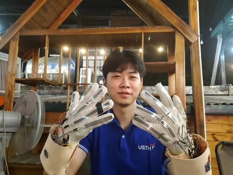
<br/><em>The V-Hand sensor gloves — an MPU6050 IMU + 5 flex sensors per hand, streaming over ESP32</em>
</div>

---

## Project Status — *Complete & Demo-Ready*

| Capability | Status |
|---|:---:|
| Multi-format model upload (`.tflite` `.keras` `.h5` `.pth` `.pt`) | Done |
| Runtime preflight validation before activation | Done |
| Live camera (MediaPipe / YOLO landmark) inference path | Done |
| Live ESP32 glove sensor streaming + inference | Done |
| Temporal LSTM classification (single-frame **and** rolling-window) | Done |
| Real-time WebSocket stream → prediction → Text-to-Speech | Done |
| Split runtime microservices (TF / PyTorch) + Docker profile | Done |
| Hybrid storage — PostgreSQL (jobs/users/datasets) + MongoDB (sessions/registry) | Done |
| Async pipeline — Redis + Celery workers (dataset, early-fusion, preprocess) | Done |
| Early-fusion (74-d CV+sensor) inference & preprocessing workers | Done |
| Prometheus / Grafana monitoring with celery-exporter | Done |
| V-Hand competition demo with built-in Test Lab | Done |

Developed **Jan – Mar 2026** as a third-year engineering project (USTH). 298 commits, 5 contributors, runs end-to-end with no cloud dependency.

---

## Live Inference in Action

Real-time hand-gesture recognition in the Realtime AI Playground — MediaPipe's 21-point hand skeleton tracked live, with an on-screen HUD for FPS, signal condition, detected gesture, and confidence.

| | |
|:---:|:---:|
| 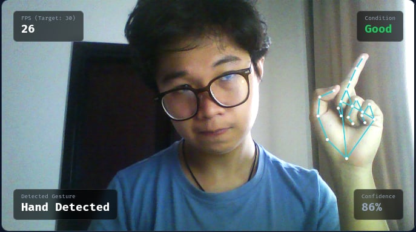 | 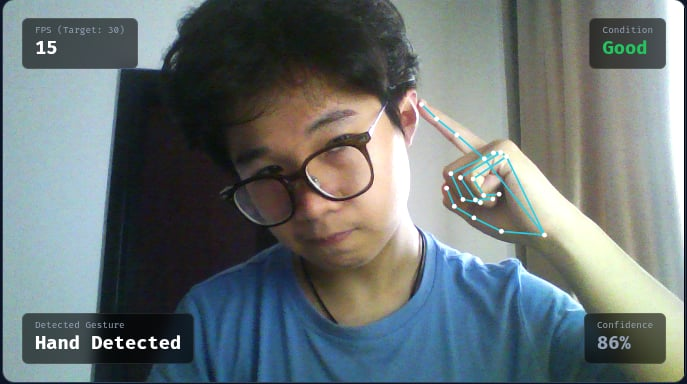 |
| 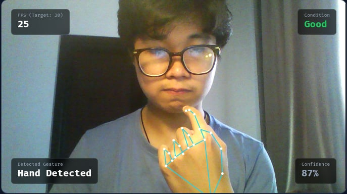 | 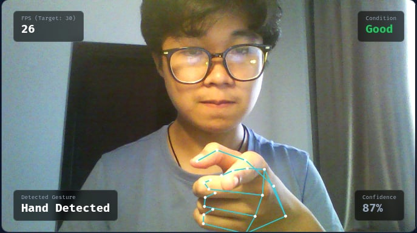 |

<div align="center"><em>Live landmark tracking at ~25 FPS · 86–87% confidence · running locally, no cloud</em></div>

https://github.com/user-attachments/assets/272ba3f2-6344-49f8-b760-abc512da9d21

<div align="center"><sub>Full UI walkthrough — playground, training, fusion, and live inference</sub></div>

---

## The Application

The Vue 3 frontend is the control center for the whole platform — upload models, hot-swap classifiers, capture datasets, run live CV/sensor inference, and monitor production health.

| Realtime AI Playground | Model Library |
|:---:|:---:|
| 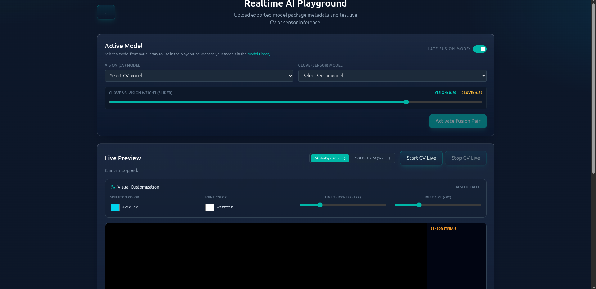 | 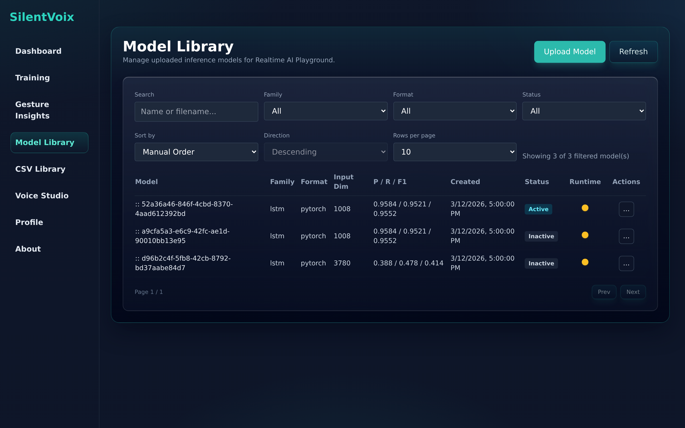 |
| Hot-swap CV + sensor classifiers, single / early / late fusion modes, live inference | Multi-format registry — upload, validate, activate, and compare uploaded models |

| Sensor Training | Fusion Training |
|:---:|:---:|
| 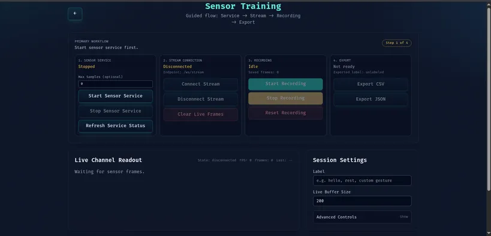 | 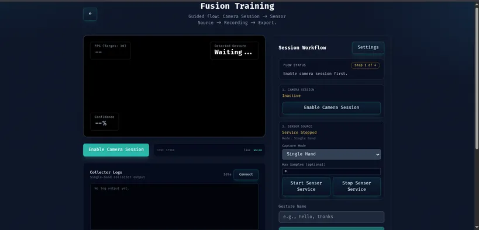 |
| Guided glove capture: service → stream → record → export | Synchronized camera + sensor capture workflow |

| CSV Library | Model Monitoring |
|:---:|:---:|
| 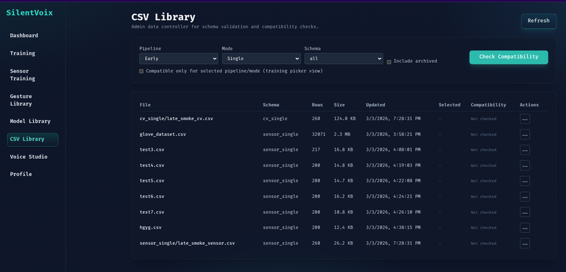 | 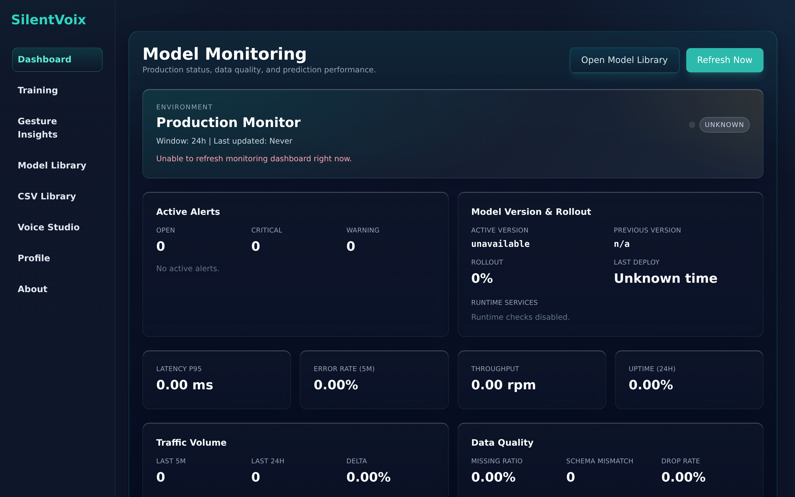 |
| Dataset schema validation & pipeline-compatibility checks | Runtime health, alerts, rollout & data-quality metrics |

---

## Evaluation & Results

SilentVoix ships with reproducible evaluation artifacts under [`AI/results/`](AI/results/). Two model families were trained and benchmarked:

### Sensor LSTM — Glove gesture classifier
Trained on **2,428** real glove sequences (11 features/frame: 3× accel + 3× gyro + 5× flex).

| Metric | Score |
|---|:---:|
| **Accuracy** | **99.59%** |
| Macro F1 | 0.9959 |
| Precision (macro) | 0.9961 |
| Recall (macro) | 0.9957 |
| Test samples | 243 |

<div align="center">
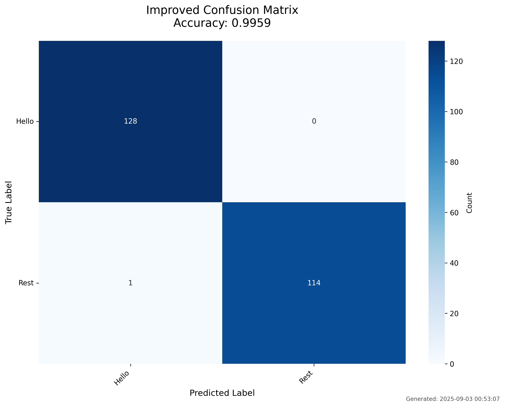
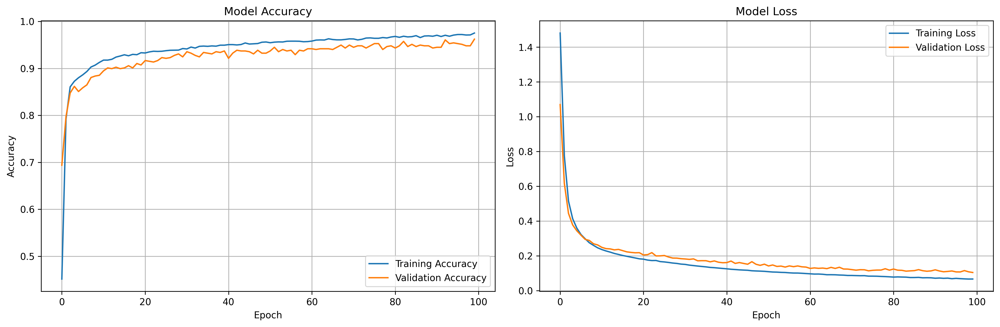
</div>

<div align="center">
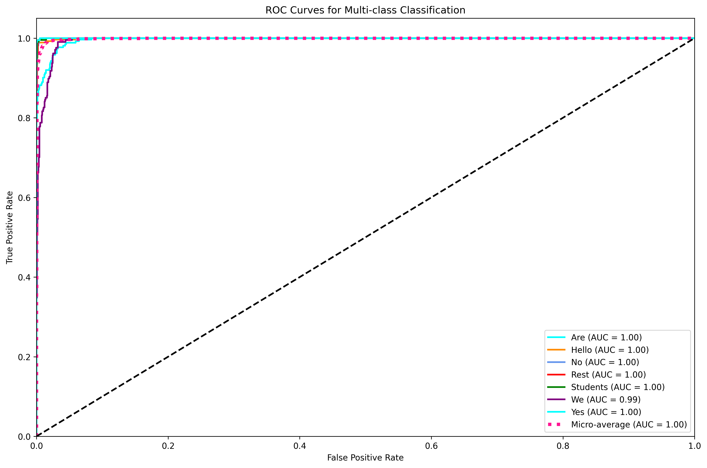
</div>

### CV LSTM — Camera landmark classifier
Temporal model over MediaPipe hand landmarks (16 frames × 63 features), 5 gesture classes: `Hello`, `Goodbye`, `Yes`, `No`, `Thank you`.

| Metric | Score |
|---|:---:|
| **F1** | **0.955** |
| Precision | 0.958 |
| Recall | 0.952 |

### Model comparison

Every model below is hot-swappable in the playground via the registry — *upload, validate, activate, infer.*

| Model | Modality | Format | Input shape | F1 / Acc | Notes |
|---|---|---|---|:---:|---|
| **Sensor LSTM** | Glove sensors | PyTorch | `30 × 11` | **0.996** | Production demo model |
| **CV LSTM (V2)** | Camera | PyTorch | `16 × 63` | **0.955** | MediaPipe landmarks |
| CV Temporal (V2) | Camera | PyTorch | `16 × 63` | 0.414 | Early temporal baseline |
| YOLO-Hand | Camera | YOLO | detector | — | Hand-region pre-stage |

> The comparison itself is a feature: SilentVoix exists to make *"is this exported model actually any good live?"* a one-click question.

---

## Architecture

```
                            ┌──────── Realtime path (low latency) ────────┐
ESP32 Glove ──50Hz──▶ WebSocket Bridge ──▶ FastAPI (api/)                 │
   flex + IMU            /ws/stream           │ normalize → 11-value frame │
                                              │ rolling window buffer      │
                                              ▼                            │
                            ┌─────────────────────────────────┐           │
                            │  Runtime dispatch (worker-library)│           │
                            └───────┬───────────────┬───────────┘           │
                                    ▼               ▼                       │
                          ml-pytorch (8092)   ml-tensorflow (8091)          │
                                    └──────┬────────┘                       │
                                           ▼  prediction + confidence       │
                              Vue 3 frontend (vue-next/) ──▶ Text-to-Speech │
                            └─────────────────────────────────────────────┘

                            ┌──── Async path (heavy / batch jobs) ────┐
  Dataset upload / fusion ──▶ FastAPI enqueues job ──▶ Redis (broker) │
                                       │                              │
                          ┌────────────┴───────────────┐              │
                          ▼              ▼              ▼              │
                     worker         worker-          worker-          │
                  (celery jobs)   early-fusion    fusion-preprocess   │
                          │       (74-d fused      (video+CSV align,  │
                          │        inference)       OpenCV, CSV out)  │
                          └────────────┬───────────────┘              │
                                       ▼  JobRecord status + results  │
                       PostgreSQL (jobs, users, datasets, models)     │
                            └─────────────────────────────────────────┘

  Storage: PostgreSQL (relational/jobs) + MongoDB (sessions/registry) + Redis (cache & broker)
  Observability: Prometheus + Grafana + celery-exporter
```

| Component | Role |
|---|---|
| [`api/`](api/) | Canonical FastAPI app — auth, registry, live WebSocket ingest & broadcast, job enqueue |
| [`vue-next/`](vue-next/) | Vue 3 frontend — playground, model library, live demo, dashboards |
| [`ml-pytorch/`](ml-pytorch/) | PyTorch-family inference microservice |
| [`ml-tensorflow/`](ml-tensorflow/) | TensorFlow / TFLite inference microservice |
| [`worker-library/`](worker-library/) | Reconciles model-library registry state |
| [`workers/`](workers/) | Celery workers — async dataset jobs (scan, export) with `JobRecord` tracking |
| [`worker-early-fusion/`](worker-early-fusion/) | Early-fusion service — builds 74-dim fused frames (63 CV + 11 sensor), runs fused LSTM inference |
| [`worker-fusion-preprocess/`](worker-fusion-preprocess/) | Aligns & preprocesses raw video + sensor CSV into fused training datasets (OpenCV) |
| `PostgreSQL 16` | Relational store — jobs, users, datasets, models (SQLAlchemy async + Alembic migrations) |
| `MongoDB` | Document store — live sessions & model registry |
| `Redis 7` | Celery broker / result backend + caching layer |
| `Prometheus + Grafana` | Metrics & dashboards (incl. `celery-exporter` for queue health) |

### Async processing & storage

Heavy work never blocks the realtime path. The API validates a request, writes a `JobRecord` to **PostgreSQL**, and enqueues a task onto **Redis**; **Celery** workers pick it up and update progress as they go:

- **`worker`** — general Celery queue for dataset jobs (e.g. `scan_dataset_task`), with per-job status/progress persisted to Postgres.
- **`worker-fusion-preprocess`** — ingests a recorded video + sensor CSV, aligns the two streams frame-by-frame (OpenCV), and emits a fused, training-ready dataset.
- **`worker-early-fusion`** — concatenates CV landmarks and sensor values into a single **74-feature** frame (`63 vision + 11 sensor`, sequence length 30) and serves fused-model inference — the [`model_fit.py`](model_fit.py) training contract.

Data is split by access pattern: **PostgreSQL** for transactional/relational state (jobs, users, datasets, models via Alembic-migrated schemas in [`db/`](db/)), **MongoDB** for high-write live sensor sessions and the model registry, and **Redis** as both the task broker and a cache.

<div align="center">
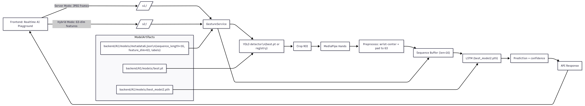
<br/><em>Model-processing & playground inference flow</em>
</div>

<details>
<summary>More diagrams (system & database)</summary>

<div align="center">
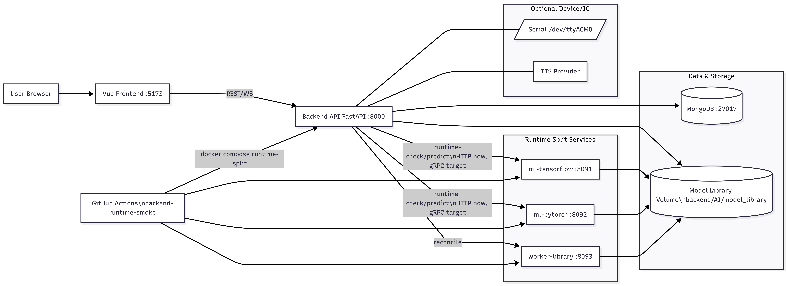
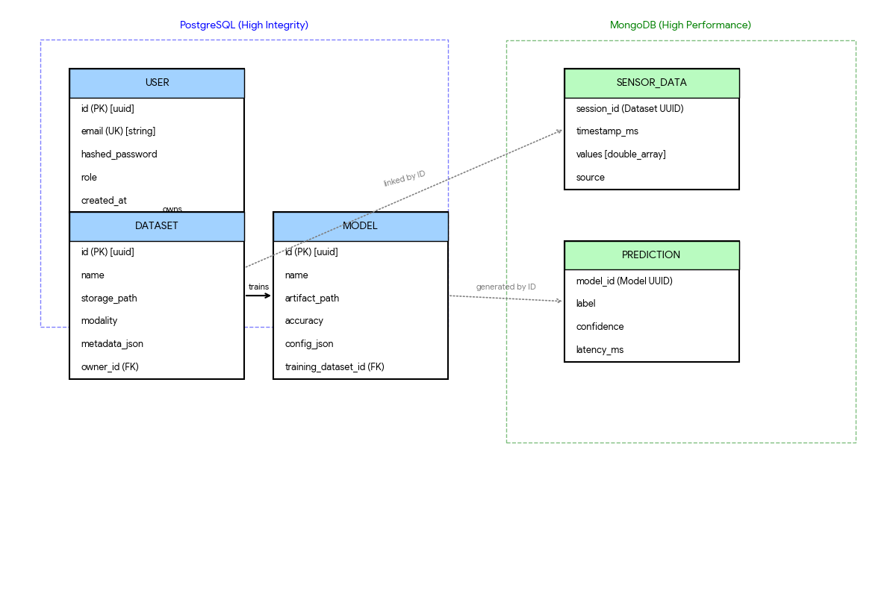
</div>

</details>

### Performance targets (demo acceptance)

| Stage | Target |
|---|---|
| Sensor sampling | 50 Hz (20 ms) |
| API ingest + normalization | < 10 ms / frame |
| Inference latency | < 40 ms median |
| Frame → UI update | < 120 ms end-to-end |
| Sustained runtime | 10 min, no manual recovery |

---

## Quick Start

**Requirements:** Python 3.10+ · Node.js LTS · npm · Docker (PostgreSQL · MongoDB · Redis)

```bash
# Backend API
cd api  # canonical app (backend/ is legacy-compatible)
python3 -m venv venv && source venv/bin/activate
pip install -r requirements-api.txt

# Frontend
cd ../vue-next && npm install

# Run the full local dev stack
cd .. && ./run_dev.sh
```

**Runtime-split Docker profile** (separate TF / PyTorch services):

```bash
USE_RUNTIME_SERVICES=true USE_WORKER_LIBRARY=true \
docker compose -f docker-compose.dev.yml --profile runtime-split up -d
```

### Default dev URLs

| Service | URL |
|---|---|
| Frontend | `http://localhost:5173` |
| Backend API | `http://localhost:8000` |
| TensorFlow runtime | `http://localhost:8091` |
| PyTorch runtime | `http://localhost:8092` |
| Worker library | `http://localhost:8093` |
| Fusion preprocess worker | `http://localhost:8094` |
| Early fusion worker | `http://localhost:8095` |
| PostgreSQL | `localhost:5432` |
| MongoDB | `localhost:27017` |
| Redis | `localhost:6379` |

> Note: PyTorch uploads must be **callable inference artifacts** — `state_dict`-only checkpoints are not valid runtime artifacts.

---

## Tech Stack

**Backend** FastAPI · Python · WebSockets · SQLAlchemy (async) · Alembic · Docker Compose
**Data & queue** PostgreSQL 16 · MongoDB · Redis 7 · Celery (workers + beat)
**ML** PyTorch · TensorFlow / TFLite · LSTM · MediaPipe · YOLO · OpenCV · scikit-learn
**Frontend** Vue 3 · Pinia · Vue Router · Vite · PrimeIcons · Web Speech API (TTS)
**Hardware** ESP32 · MPU6050 IMU · 5× flex sensors
**Tooling & ops** Vitest · Playwright · Prometheus / Grafana · celery-exporter

---

## Documentation

- [docs/README.md](docs/README.md) — documentation index
- [transformation.md](transformation.md) — V-Hand engineering spec & data contracts
- [docs/hybrid_database_architecture.md](docs/hybrid_database_architecture.md) — hybrid MongoDB store design
- [docs/playground_old_model_eval.md](docs/playground_old_model_eval.md) — model evaluation methodology
- [docs/migration_guide.md](docs/migration_guide.md) — migration notes

---

## Contributors

This project was built by a student team. Huge thanks to everyone who shaped it:

| Contributor | Role | Contributions |
|---|---|:---:|
| **Do Hung Anh** ([@lystiger](https://github.com/lystiger)) | Lead — architecture, runtime services, playground, live pipeline | 218 commits |
| **Do Tran Nam Anh** | Backend & ML integration, model registry | 60 commits |
| **Nguyen Nam Khanh** | Frontend & data pipeline | 15 commits |
| **Nguyen Duc Anh** | Data collection & testing | 2 commits |

<sub>Commit counts via `git shortlog`. Project developed at USTH, 2026.</sub>

---

<div align="center">

**SilentVoix — giving a voice to every hand.**

<sub>Keep secrets out of version control — use `backend/.env` for local config. The API container uses `backend/requirements-api.txt`, not the monolithic ML dependency set.</sub>

</div>
