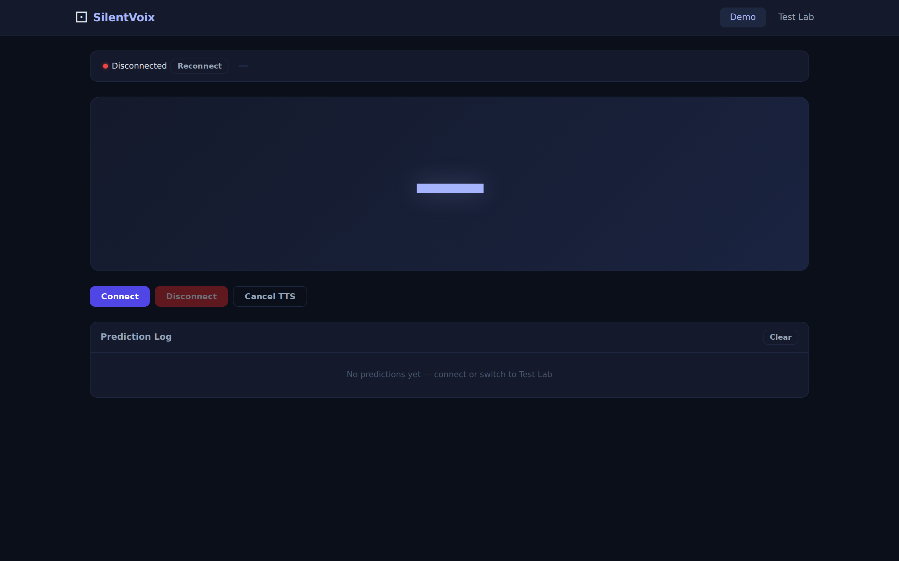
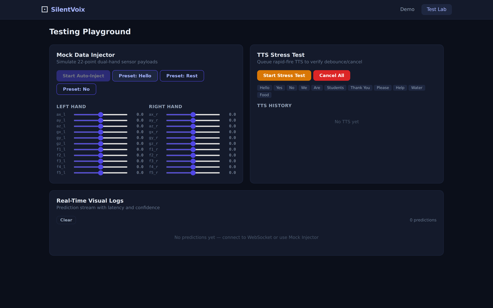

<div align="center">

# 🤟 SilentVoix · V-Hand

### *Your Hand, Your Voice.*

**A real-time sign-language recognition platform and multi-format AI playground that turns glove sensors and camera input into spoken language.**

[](#)
[](#)
[](#)
[](#)
[](#)
[](#)
[](#)

</div>

---

## ✨ What is SilentVoix?

SilentVoix is a **sign-glove + computer-vision platform** built around a **multi-format model testing ground**. You train models *anywhere* (Colab, local, any framework), then upload the exported artifact and let the playground handle storage, validation, activation, and **live real-time inference** — across both **camera (CV)** and **wearable-sensor** modalities.

The flagship build, **V-Hand**, is a competition-ready demo: an ESP32 glove streams flex + motion data at 50 Hz over WebSocket, an LSTM classifies the gesture, and the browser speaks the result aloud — fully offline, on the local network.

> **One platform, two modalities, many model formats.** Drop in a `.pth`, `.tflite`, `.keras`, `.h5`, or `.pt` model and test it live in seconds.

---

## 🎯 Project Status — *Complete & Demo-Ready*

| Capability | Status |
|---|:---:|
| Multi-format model upload (`.tflite` `.keras` `.h5` `.pth` `.pt`) | ✅ |
| Runtime preflight validation before activation | ✅ |
| Live camera (MediaPipe / YOLO landmark) inference path | ✅ |
| Live ESP32 glove sensor streaming + inference | ✅ |
| Temporal LSTM classification (single-frame **and** rolling-window) | ✅ |
| Real-time WebSocket stream → prediction → Text-to-Speech | ✅ |
| Split runtime microservices (TF / PyTorch) + Docker profile | ✅ |
| Hybrid MongoDB model registry & dataset library | ✅ |
| V-Hand competition demo with built-in Test Lab | ✅ |

Developed **Jan – Mar 2026** as a third-year engineering project (USTH). 298 commits, 5 contributors, runs end-to-end with no cloud dependency.

---

## 🖥️ Live Demo Playground

The **V-Hand** demo surface ships with a live inference view and a self-contained **Test Lab** for validating the pipeline without hardware.

| Live Inference View | Test Lab — 22-point dual-hand injector |
|:---:|:---:|
|  |  |
| Connection state, prediction feed, latency & TTS controls | Mock sensor injector, gesture presets, TTS stress test |

*Screenshots captured automatically with [Playwright](https://playwright.dev) against the production build.*

---

## 📊 Evaluation & Results

SilentVoix ships with reproducible evaluation artifacts under [`AI/results/`](AI/results/). Two model families were trained and benchmarked:

### Sensor LSTM — Glove gesture classifier
Trained on **2,428** real glove sequences (11 features/frame: 3× accel + 3× gyro + 5× flex).

| Metric | Score |
|---|:---:|
| **Accuracy** | **99.59%** |
| Macro F1 | 0.9959 |
| Precision (macro) | 0.9961 |
| Recall (macro) | 0.9957 |
| Test samples | 243 |

<div align="center">


</div>

<div align="center">

</div>

### CV LSTM — Camera landmark classifier
Temporal model over MediaPipe hand landmarks (16 frames × 63 features), 5 gesture classes: `Hello`, `Goodbye`, `Yes`, `No`, `Thank you`.

| Metric | Score |
|---|:---:|
| **F1** | **0.955** |
| Precision | 0.958 |
| Recall | 0.952 |

### Model comparison

Every model below is hot-swappable in the playground via the registry — *upload, validate, activate, infer.*

| Model | Modality | Format | Input shape | F1 / Acc | Notes |
|---|---|---|---|:---:|---|
| **Sensor LSTM** | Glove sensors | PyTorch | `30 × 11` | **0.996** | Production demo model |
| **CV LSTM (V2)** | Camera | PyTorch | `16 × 63` | **0.955** | MediaPipe landmarks |
| CV Temporal (V2) | Camera | PyTorch | `16 × 63` | 0.414 | Early temporal baseline |
| YOLO-Hand | Camera | YOLO | detector | — | Hand-region pre-stage |

> 💡 The comparison itself is a feature: SilentVoix exists to make *"is this exported model actually any good live?"* a one-click question.

---

## 🏗️ Architecture

```
ESP32 Glove ──50Hz──▶ WebSocket Bridge ──▶ FastAPI (api/)
   flex + IMU            /ws/stream           │ normalize → canonical 11-value frame
                                              │ rolling window buffer
                                              ▼
                            ┌─────────────────────────────────┐
                            │  Runtime dispatch (worker-library)│
                            └───────┬───────────────┬───────────┘
                                    ▼               ▼
                          ml-pytorch (8092)   ml-tensorflow (8091)
                                    │               │
                                    └──────┬────────┘
                                           ▼
                              prediction + confidence + latency
                                           ▼
                              Vue 3 frontend (vue-next/) ──▶ 🔊 Text-to-Speech
```

| Component | Role |
|---|---|
| [`api/`](api/) | Canonical FastAPI app — auth, registry, live WebSocket ingest & broadcast |
| [`vue-next/`](vue-next/) | Vue 3 frontend — playground, model library, live demo, dashboards |
| [`ml-pytorch/`](ml-pytorch/) | PyTorch-family inference microservice |
| [`ml-tensorflow/`](ml-tensorflow/) | TensorFlow / TFLite inference microservice |
| [`worker-library/`](worker-library/) | Reconciles model-library registry state |
| `MongoDB` | Hybrid store for model registry, sessions & datasets |

<div align="center">

<br/><em>Model-processing & playground inference flow</em>
</div>

<details>
<summary>📐 More diagrams (system & database)</summary>

<div align="center">


</div>

</details>

### ⚡ Performance targets (demo acceptance)

| Stage | Target |
|---|---|
| Sensor sampling | 50 Hz (20 ms) |
| API ingest + normalization | < 10 ms / frame |
| Inference latency | < 40 ms median |
| Frame → UI update | < 120 ms end-to-end |
| Sustained runtime | 10 min, no manual recovery |

---

## 🚀 Quick Start

**Requirements:** Python 3.10+ · Node.js LTS · npm · MongoDB

```bash
# Backend API
cd api  # canonical app (backend/ is legacy-compatible)
python3 -m venv venv && source venv/bin/activate
pip install -r requirements-api.txt

# Frontend
cd ../vue-next && npm install

# Run the full local dev stack
cd .. && ./run_dev.sh
```

**Runtime-split Docker profile** (separate TF / PyTorch services):

```bash
USE_RUNTIME_SERVICES=true USE_WORKER_LIBRARY=true \
docker compose -f docker-compose.dev.yml --profile runtime-split up -d
```

### Default dev URLs

| Service | URL |
|---|---|
| Frontend | `http://localhost:5173` |
| Backend API | `http://localhost:8000` |
| TensorFlow runtime | `http://localhost:8091` |
| PyTorch runtime | `http://localhost:8092` |
| Worker library | `http://localhost:8093` |

> ⚠️ PyTorch uploads must be **callable inference artifacts** — `state_dict`-only checkpoints are not valid runtime artifacts.

---

## 🧰 Tech Stack

**Backend** FastAPI · Python · WebSockets · MongoDB · Docker Compose
**ML** PyTorch · TensorFlow / TFLite · LSTM · MediaPipe · YOLO · scikit-learn
**Frontend** Vue 3 · Pinia · Vue Router · Vite · PrimeIcons · Web Speech API (TTS)
**Hardware** ESP32 · MPU6050 IMU · 5× flex sensors
**Tooling** Vitest · Playwright · Prometheus / Grafana monitoring

---

## 📚 Documentation

- [docs/README.md](docs/README.md) — documentation index
- [transformation.md](transformation.md) — V-Hand engineering spec & data contracts
- [docs/hybrid_database_architecture.md](docs/hybrid_database_architecture.md) — hybrid MongoDB store design
- [docs/playground_old_model_eval.md](docs/playground_old_model_eval.md) — model evaluation methodology
- [docs/migration_guide.md](docs/migration_guide.md) — migration notes

---

## 👥 Contributors

This project was built by a student team. Huge thanks to everyone who shaped it:

| Contributor | Role | Contributions |
|---|---|:---:|
| **Do Hung Anh** ([@lystiger](https://github.com/lystiger)) | Lead — architecture, runtime services, playground, live pipeline | 218 commits |
| **Do Tran Nam Anh** | Backend & ML integration, model registry | 60 commits |
| **Nguyen Nam Khanh** | Frontend & data pipeline | 15 commits |
| **Nguyen Duc Anh** | Data collection & testing | 2 commits |

<sub>Commit counts via `git shortlog`. Project developed at USTH, 2026.</sub>

---

<div align="center">

**SilentVoix — giving a voice to every hand.** 🤟🔊

<sub>Keep secrets out of version control — use `backend/.env` for local config. The API container uses `backend/requirements-api.txt`, not the monolithic ML dependency set.</sub>

</div>
