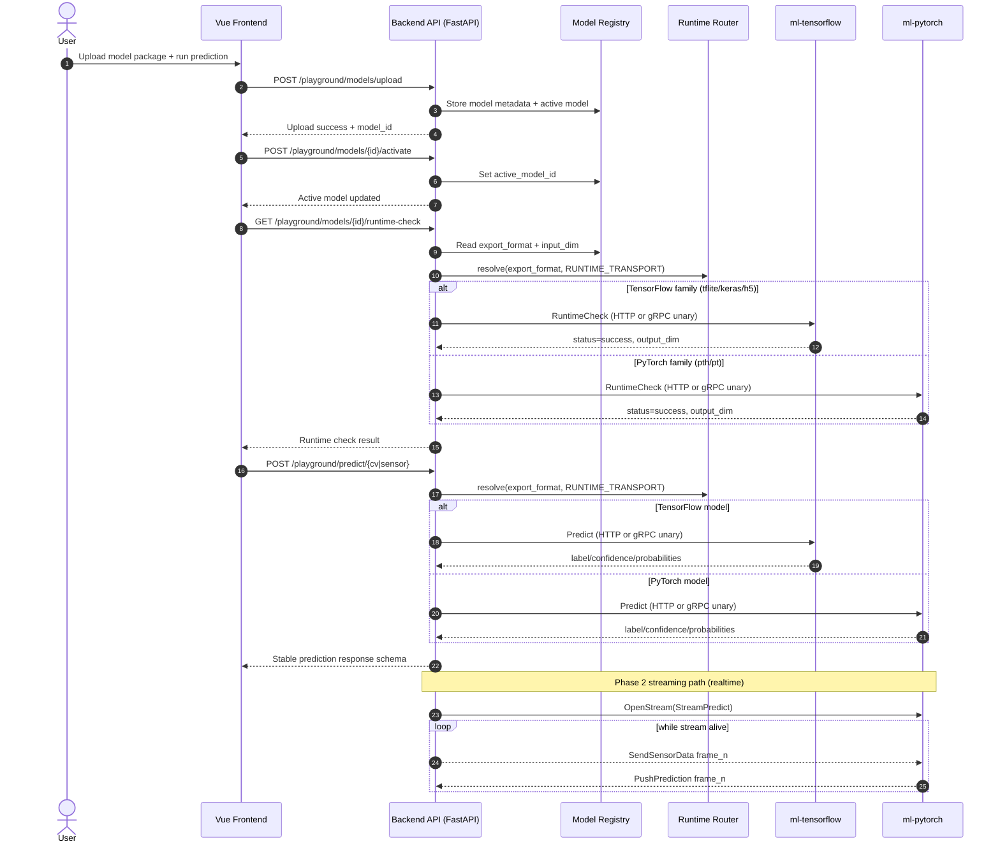
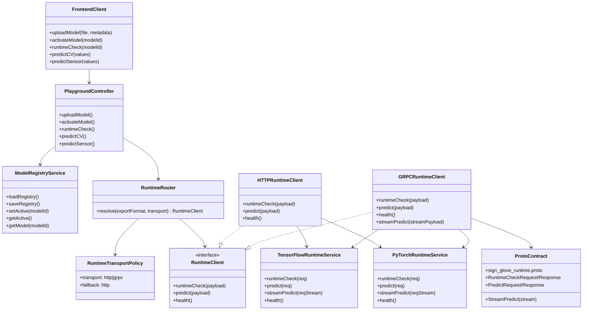

# SilentVoix gRPC Migration Mermaid Pack

Aligned with `docs/migration_gRPC.md` Phase 2 plan:
- external API remains REST/WS
- internal runtime calls move HTTP -> gRPC (dual-stack first)
- `RUNTIME_TRANSPORT=http|grpc` controls backend runtime transport

## 1) Sequence Diagram


## 2) Class Diagram


## 3) Use Case Diagram
```mermaid
usecaseDiagram
    actor Viewer
    actor Editor
    actor Admin
    actor CI as CI Pipeline

    rectangle SilentVoix {
      (Login / Auth)
      (Upload Model Package)
      (Activate Model)
      (Run Runtime Check)
      (Realtime Predict CV/Sensor)
      (View Monitoring Dashboard)
      (Manage CSV Library)
      (Run Runtime Smoke Test)
      (Inspect Service Health)
      (Reconcile Model Registry)
      (Meet Realtime SLA < 50ms)
      (Select Runtime Transport)
      (Rollback to HTTP Transport)
    }

    Viewer --> (Login / Auth)
    Viewer --> (View Monitoring Dashboard)
    Viewer --> (Realtime Predict CV/Sensor)

    Editor --> (Login / Auth)
    Editor --> (Upload Model Package)
    Editor --> (Activate Model)
    Editor --> (Run Runtime Check)
    Editor --> (Realtime Predict CV/Sensor)
    Editor --> (Inspect Service Health)
    Editor --> (Meet Realtime SLA < 50ms)

    Admin --> (Login / Auth)
    Admin --> (Manage CSV Library)
    Admin --> (Reconcile Model Registry)
    Admin --> (Upload Model Package)
    Admin --> (Activate Model)
    Admin --> (Select Runtime Transport)
    Admin --> (Rollback to HTTP Transport)

    CI --> (Run Runtime Smoke Test)
    (Run Runtime Smoke Test) ..> (Upload Model Package) : includes
    (Run Runtime Smoke Test) ..> (Activate Model) : includes
    (Run Runtime Smoke Test) ..> (Run Runtime Check) : includes
    (Run Runtime Smoke Test) ..> (Realtime Predict CV/Sensor) : includes
    (Rollback to HTTP Transport) ..> (Select Runtime Transport) : extends
```

## 4) Whole-Project Architecture
```mermaid
flowchart LR
    U[User Browser] --> FE[Vue Frontend :5173]
    FE -->|REST/WS| API[Backend API FastAPI :8000]
    API --> CFG[[RUNTIME_TRANSPORT=http|grpc]]

    subgraph DataPlane[Data & Storage]
      MDB[(MongoDB :27017)]
      LIB[(Model Library Volume\nbackend/AI/model_library)]
    end

    API --> MDB
    API --> LIB

    subgraph RuntimeSplit[Runtime Split Services]
      TF[ml-tensorflow :8091]
      PT[ml-pytorch :8092]
      WK[worker-library :8093]
    end

    API -->|runtime-check/predict\nHTTP (fallback)| TF
    API -->|runtime-check/predict\nHTTP (fallback)| PT
    API -->|runtime-check/predict\ngRPC over HTTP/2| TF
    API -->|runtime-check/predict\ngRPC over HTTP/2| PT
    API -->|reconcile| WK
    TF --> LIB
    PT --> LIB
    WK --> LIB

    PROTO[[sign_glove_runtime.proto]]
    PROTO -. shared contract .- API
    PROTO -. shared contract .- TF
    PROTO -. shared contract .- PT

    subgraph HardwareIO[Optional Device/IO]
      DEV[/Serial /dev/ttyACM0/]
      TTS[TTS Provider]
    end
    API --- DEV
    API --- TTS

    CI[GitHub Actions\nbackend-runtime-smoke] -->|docker compose runtime-split| API
    CI --> TF
    CI --> PT
    CI --> WK
    CI --> ART[(smoke log artifacts)]
```
