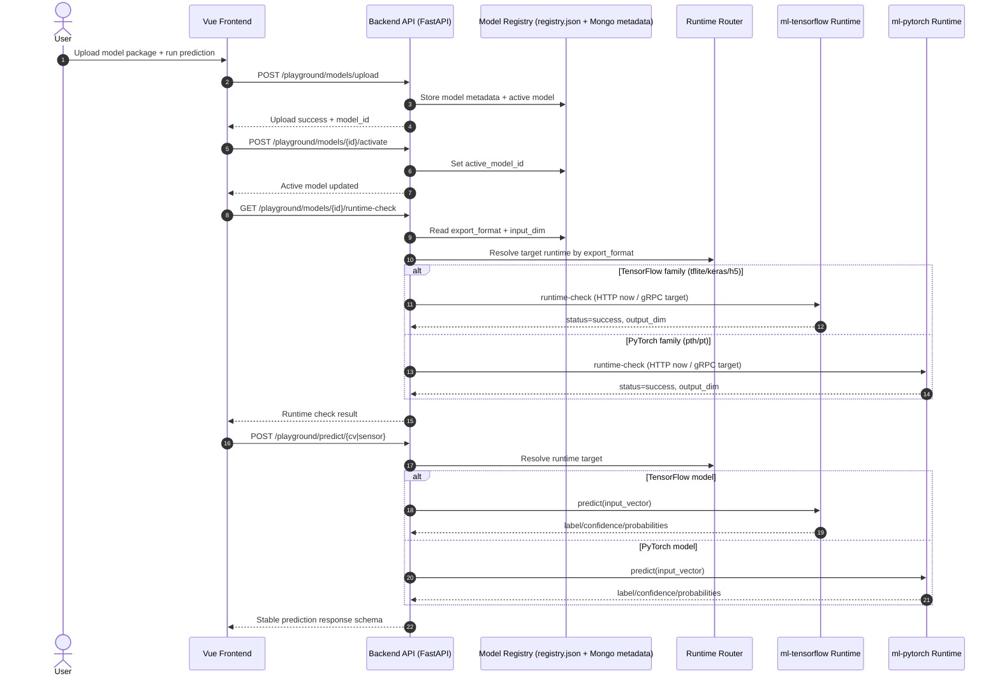
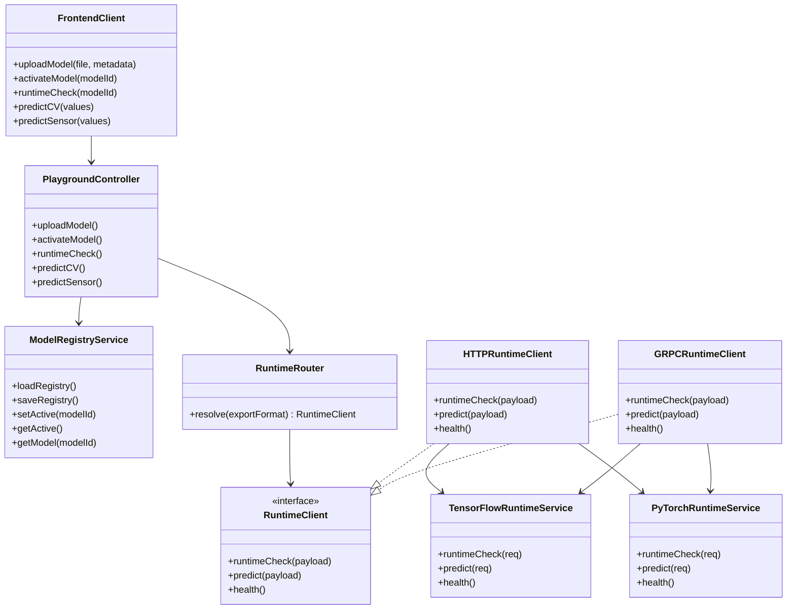
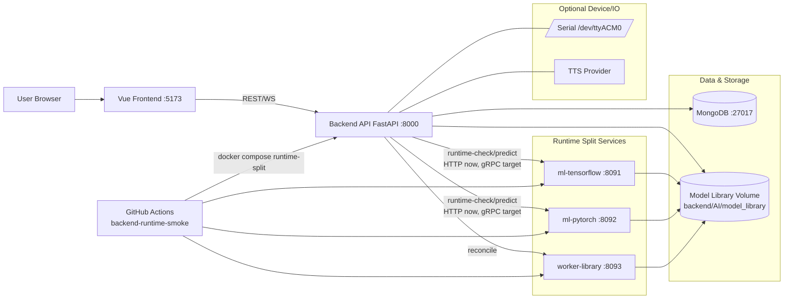

# SilentVoix gRPC-Ready Mermaid Pack

Yes, this project can reach gRPC level.  
Your runtime split (`backend` + `ml-tensorflow` + `ml-pytorch` + `worker-library`) is already a strong base for moving internal service-to-service traffic from HTTP/JSON to gRPC.

## 1) Sequence Diagram


## 2) Class Diagram


## 3) Use Case Diagram
```mermaid
usecaseDiagram
    actor Viewer
    actor Editor
    actor Admin
    actor CI as CI Pipeline

    rectangle SilentVoix {
      (Login / Auth)
      (Upload Model Package)
      (Activate Model)
      (Run Runtime Check)
      (Realtime Predict CV/Sensor)
      (View Monitoring Dashboard)
      (Manage CSV Library)
      (Run Runtime Smoke Test)
      (Inspect Service Health)
      (Reconcile Model Registry)
    }

    Viewer --> (Login / Auth)
    Viewer --> (View Monitoring Dashboard)
    Viewer --> (Realtime Predict CV/Sensor)

    Editor --> (Login / Auth)
    Editor --> (Upload Model Package)
    Editor --> (Activate Model)
    Editor --> (Run Runtime Check)
    Editor --> (Realtime Predict CV/Sensor)
    Editor --> (Inspect Service Health)

    Admin --> (Login / Auth)
    Admin --> (Manage CSV Library)
    Admin --> (Reconcile Model Registry)
    Admin --> (Upload Model Package)
    Admin --> (Activate Model)

    CI --> (Run Runtime Smoke Test)
    (Run Runtime Smoke Test) ..> (Upload Model Package) : includes
    (Run Runtime Smoke Test) ..> (Activate Model) : includes
    (Run Runtime Smoke Test) ..> (Run Runtime Check) : includes
    (Run Runtime Smoke Test) ..> (Realtime Predict CV/Sensor) : includes
```

## 4) Whole-Project Architecture

