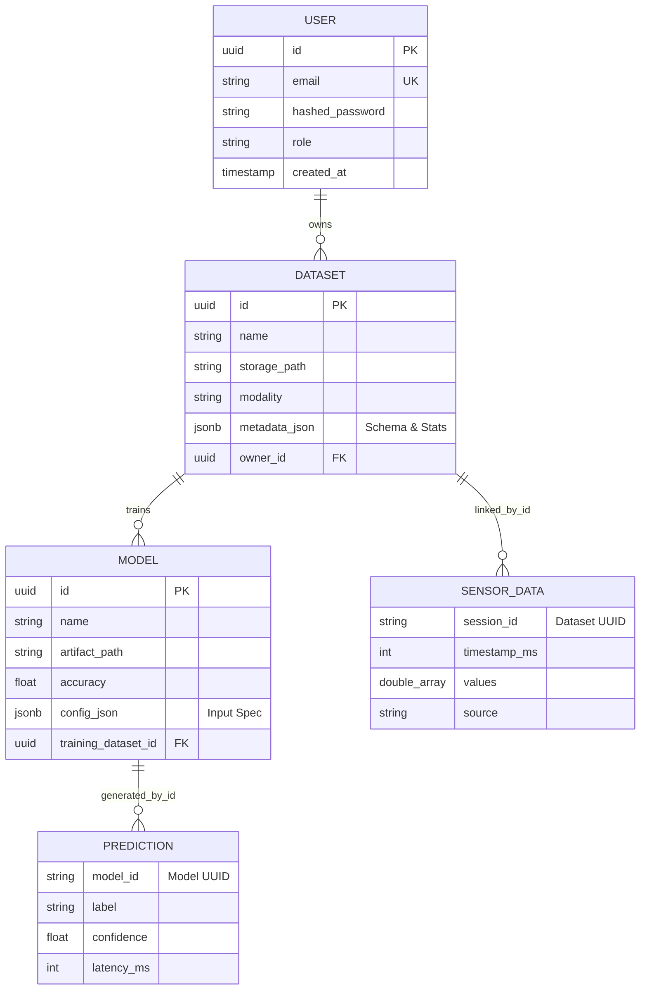

# SignGlove V3 Hybrid Database Architecture

This document outlines the "Bond" between **PostgreSQL** and **MongoDB** in the SignGlove V3 system.

## 1. The Strategy: Separation of Concerns

To achieve both high-integrity management and high-volume performance, we split our data:

*   **PostgreSQL (Relational)**: Handles high-integrity, structured data such as User Auth, Dataset Metadata, and Model Registry. It uses `JSONB` for flexible but queried model configurations.
*   **MongoDB (Document/NoSQL)**: Handles high-velocity, unstructured streams of ML sensor data and real-time prediction logs.

---

## 2. Database Relationship Diagram (Mermaid)

The "Bond" is established via unique identifiers (UUIDs) generated in PostgreSQL and referenced in MongoDB documents.

---

## 3. The "Bond" Mechanism

### Relational Integrity (PostgreSQL)
We use **SQLAlchemy** with **asyncpg** to manage the lifecycle of our core entities. 
- **Users**: Strict unique constraints on email.
- **Datasets/Models**: Foreign key constraints ensure that artifacts are never "orphaned." If a user is deleted, their metadata remains or cascades according to policy.

### Performance Data (MongoDB)
We use the **Motor** driver for asynchronous non-blocking I/O.
- **Sensor Data**: Linked to a `Dataset.id` via the `session_id` field.
- **Indexing**: MongoDB is indexed on `session_id` and `timestamp_ms` to ensure sub-millisecond retrieval of temporal sequences, as verified in our harsh tests.

---

## 4. Key Architectural Benefits

1.  **Immutability**: Following the "Artifact Chaos" prevention strategy, every new model training run creates a new entry in PostgreSQL and a new storage directory, preventing race conditions.
2.  **Scalability**: We can scale PostgreSQL vertically for complex queries and MongoDB horizontally (sharding) for millions of sensor frames.
3.  **JSONB Flexibility**: PostgreSQL `JSONB` columns allow us to store different metadata schemas for `CV`, `Sensor`, and `Fusion` datasets without performing costly SQL migrations for every new ML experiment.
4.  **Async-First**: Both database layers are fully asynchronous, ensuring the API remains responsive (sub-10ms) even under heavy load.
