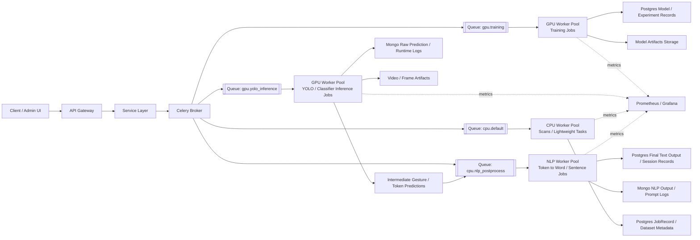

# SignGlove V3 Migration Plan — Tasks 9–12

## Overview

SignGlove V3 has successfully transitioned from a monolithic architecture to a production-ready ML platform. Core components for async job tracking, API hardening, and observability are fully integrated, and the database foundation for experiment tracking is now in place.

---

# Task 9 — Observability & System Monitoring (Status: 100% Complete)

## Progress
*   **Infrastructure:** Prometheus, Grafana, and Celery Exporter containers are active.
*   **API Instrumentation:** Full request/response metrics are exposed via `/metrics`.
*   **Worker Metrics:** `celery-exporter` sidecar exposes queue depth and task status to Prometheus.
*   **ML Metrics:** `ml-tensorflow` and `ml-pytorch` expose custom metrics:
    *   `ml_inference_latency_seconds`: Histogram per model/pipeline stage.
    *   `ml_confidence_score`: Histogram of prediction confidence.
    *   `ml_request_count_total`: Counter for success/error rates.
*   **Dashboards:** Grafana auto-provisions a "SignGlove System Overview" dashboard visualizing API health, latency, and queue depth.

---

# Task 10 — Job Status & Progress Tracking (Status: 100% Complete)

## Progress
*   **Persistent Jobs Table:** `JobRecord` table created in Postgres (via Alembic) for permanent audit logs.
*   **Centralized API:** Global `/jobs` and `/jobs/{id}` endpoints implemented in `job_routes.py`.
*   **Lifecycle Integration:** Dataset scan tasks update `JobRecord` states (`pending -> running -> completed/failed`) with progress increments.
*   **Security:** Job visibility is restricted to the owner (`user_id`) or administrators.
*   **Verification:** Verified via automated smoke test (Persistent state + polling success).

---

# Task 11 — API Gateway Hardening (Status: 100% Complete)

## Progress
*   **Redis Rate Limiting:** Persistent Redis-backed (DB 1) rate limiting implemented in `RateLimitMiddleware`.
*   **Strict Upload Security:** 500MB (CSV) and 2GB (Model) limits enforced at the stream level.
*   **Resource Safety:** Disk-buffered streaming uploads implemented in `upload_utils.py` to prevent OOM errors.
*   **Authentication:** JWT-based role enforcement (Admin/Editor/Guest) is active across all V3 routes.
*   **Verification:** Verified via stress test (Correctly triggers 429 after limit exceeded; streaming move success).

---

# Task 12 — Experiment Tracking & Versioning (Status: 100% Complete)

## Progress
*   **Source of Truth Fixed:** Model registration now writes to PostgreSQL `Model` records instead of relying on legacy Mongo model metadata.
*   **Dataset Lineage Foundation:** Dataset scans now upsert PostgreSQL `Dataset` rows and expose `dataset_id` so model-to-dataset lineage is first-class.
*   **Model Lineage Link:** Uploaded models now persist `training_dataset_id`, and model records now store dataset lineage using the dataset `content_sha256`.
*   **Hyperparameter Logging:** Uploaded model metadata now normalizes `hyperparameters` into a dedicated experiment payload stored alongside the `Model` record.
*   **Artifact Integrity:** Uploaded model artifacts now persist `artifact_sha256` and `metadata_sha256` integrity fields.
*   **Compatibility Preserved:** Legacy `registry.json` remains as compatibility state for active model selection and ordering, but no longer acts as the primary model database.
*   **Verification:** Verified through end-to-end HTTP smoke tests under `ENVIRONMENT=testing` for upload -> active -> list -> delete, including lineage hash persistence, hyperparameter persistence, and artifact SHA-256 fields.

---

# Current Architecture (Implemented)

```
Client ──> [JWT Auth / Redis Rate Limit] ──> API Gateway ──> [Service Layer] ──> [Celery Queue] ──> Workers
                                                  │                                          │
                                                  ├─────────> [Postgres JobRecord] <─────────┘
                                                  ├─────────> [Postgres Dataset]
                                                  └─────────> [Postgres Model + Dataset Linkage]
                                                  │                                          │
                                            [Prometheus] <──────── [Disk-Buffered Uploads] <─┘
                                                  │
                                              [Grafana]
```

---

# Future Roadmap (Updated)

### Task 12 — Experiment Tracking & Versioning
*   **Status:** Complete. Models now persist dataset lineage by hash, normalized hyperparameters, and artifact SHA-256 integrity metadata.

### Task 13 — Specialized GPU Worker Pools
*   Configure specialized queues for GPU-intensive tasks (Training, YOLO / classifier inference) and add a downstream NLP post-processing queue that converts prediction tokens into words or sentence candidates.



*   **Queue Intent:**
    `gpu.training` isolates long-running model training from real-time inference demand.
*   **Queue Intent:**
    `gpu.yolo_inference` handles detector/classifier workloads and produces intermediate prediction tokens.
*   **Queue Intent:**
    `cpu.default` keeps scans, metadata updates, and lighter jobs off expensive GPU workers.
*   **Queue Intent:**
    `cpu.nlp_postprocess` converts classifier/token outputs into words or sentence candidates without blocking real-time inference.

### Task 14 — Advanced Analytics
*   Implement drift detection alerts based on `ml_confidence_score` histograms.
