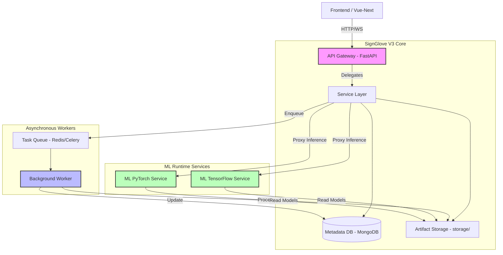

# SignGlove V3 Migration Plan

Incremental Refactor Tasks

## Objective

Migrate the current **backend monolith** into the **SignGlove V3 architecture** without breaking existing functionality.

Target architecture:

```
api/        → HTTP gateway (FastAPI)
services/   → business logic
workers/    → async heavy jobs
storage/    → datasets + model artifacts
db/         → database models + migrations
```

The migration must be **incremental and safe**.

The system must remain **functional at every step**.

---

# Migration Principles

### 1. No Big-Bang Rewrite

Changes must be incremental.

At every step:

* API must still start
* Existing endpoints must still work

---

### 2. API Must Become Lightweight

The API layer must only handle:

```
routing
authentication
request validation
service delegation
```

It must NOT handle:

```
ML inference
CSV parsing
file processing
long-running tasks
```

---

### 3. Heavy Work Must Move to Workers

Heavy tasks include:

```
dataset parsing
batch inference
metrics computation
model evaluation
```

These must run asynchronously.

---

### 4. ML Dependencies Must Be Isolated

The API container must NOT depend on:

```
torch
ultralytics
mediapipe
opencv
```

These belong in ML runtime services or workers.

---

# Task 1 — Create V3 Project Structure

## Scope

Introduce the new folder structure without moving logic yet.

Create:

```
api/
services/
workers/
storage/
db/
```

Example structure:

```
signglove/

api/
    main.py
    routes/

services/
    datasets/
    models/
    playground/

workers/
    tasks/
    worker.py

storage/
    datasets/
    models/

db/
    models.py
    migrations/
```

## Constraints

* No existing logic removed
* Backend must still start

## Tests

```
pytest
```

API should still respond:

```
GET /health
```

## Acceptance Criteria

* New folders exist
* Backend runs successfully
* CI pipeline passes

---

# Task 2 — Strip ML Dependencies from API

## Scope

Remove heavy ML libraries from API requirements.

Remove:

```
torch
ultralytics
mediapipe
opencv
```

New API requirements should only contain:

```
fastapi
pydantic
sqlalchemy
redis
httpx
uvicorn
```

## Constraints

API must not import ML libraries.

ML runtime must remain functional in separate services.

## Tests

Build API container:

```
docker build api
```

Expected improvements:

```
container size reduced
startup time improved
```

## Acceptance Criteria

* API container builds successfully
* No ML imports inside api/

---

# Task 3 — Extract Service Layer

## Scope

Move business logic from routers into `services/`.

Example:

Current:

```
admin_csv_library_routes.py
```

Refactor into:

```
services/datasets/dataset_service.py
```

Router should only delegate.

Example:

```
router → dataset_service
```

## Constraints

Router files must remain under:

```
api/routes/
```

Routers should contain minimal logic.

## Tests

Endpoint must behave identically before and after refactor.

Example:

```
POST /datasets/upload
```

returns same response.

## Acceptance Criteria

Router files reduced in size.

Target:

```
<300 lines per router
```

---

# Task 4 — Introduce Worker Queue

## Scope

Introduce async task processing.

Add queue system using:

* Redis
* task worker

Worker tasks:

```
parse_dataset()
run_inference()
compute_metrics()
```

## Architecture

```
API
  │
  ▼
Queue
  │
  ▼
Worker
```

## Constraints

API must never block for long-running tasks.

Workers must be stateless.

## Tests

Submit async job:

```
POST /datasets/upload
```

Expected:

```
job_id returned
worker processes dataset
```

## Acceptance Criteria

Dataset parsing runs in worker process.

API response time < 200 ms.

---

# Task 5 — Move CSV Parsing to Worker

## Scope

Remove dataset parsing from API.

Current flow:

```
API → parse CSV
```

New flow:

```
API → enqueue job
worker → parse CSV
```

## Constraints

Worker must handle:

```
large CSV files
malformed rows
partial failures
```

## Tests

Upload large CSV:

```
>100k rows
```

Expected:

```
API returns immediately
worker completes job
```

---

# Task 6 — Implement Model Registry Storage

## Scope

Create model artifact storage.

Directory layout:

```
storage/models/
    model_name/
        v1/
        v2/
```

Store metadata in database.

## Constraints

Model files must not be stored in SQL.

Only metadata stored.

## Tests

Upload model:

```
POST /models/upload
```

Verify:

```
artifact saved to storage/
metadata saved to DB
```

---

# Task 7 — Implement Playground Inference

## Scope

Allow developers to run inference experiments.

Flow:

```
select dataset
select model
run inference
```

Worker executes inference.

## Constraints

API must not load models directly.

Inference must run in worker.

## Tests

Run inference on sample dataset.

Expected:

```
predictions generated
metrics computed
```

---

# Task 8 — Database Migration Cleanup

## Scope

Finalize database schema.

Core tables:

```
users
datasets
models
model_versions
predictions
sessions
sensor_data
```

Use migrations.

## Constraints

No raw SQL modifications.

All schema changes must use migrations.

## Tests

Run:

```
alembic upgrade head
```

Database must initialize correctly.

---

# Final Acceptance Criteria

The system is considered migrated when:

```
API contains no ML logic
heavy jobs run in workers
dataset parsing async
model artifacts stored in storage/
routers are thin
services contain business logic
```

Expected architecture:

```
Client
   │
   ▼
API Gateway
   │
   ▼
Service Layer
   │
   ▼
Worker Queue
   │
   ▼
Workers
```

---

# Long-Term Extensions

Future improvements:

```
experiment tracking
model comparison dashboards
dataset lineage
GPU worker pool
pipeline orchestration
```

---

---

# Target V3 Architecture (Mermaid)



---

# Summary

SignGlove V3 becomes:

> A developer-first ML playground for dataset management, model registry, and inference experimentation.

The platform focuses on **orchestrating ML workflows**, not executing training inside the web server.
